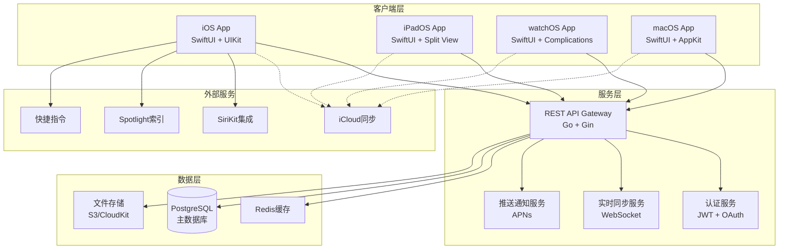

# 跨平台个人定制化TODO应用设计文档

## 概述

本设计文档基于现有的Go后端API，规划一个完整的跨平台TODO应用生态系统。应用将采用现代化的架构模式，确保在iOS、iPadOS、watchOS和macOS平台上提供一致且原生的用户体验。

## 整体架构

### 系统架构图



### 技术栈选择

**后端技术栈（基于现有代码优化）：**
- **API框架**: Go + Gin（保持现有架构）
- **数据库**: PostgreSQL（从SQLite升级，支持并发和扩展）
  - PostgreSQL：更好的JSON支持和并发性能，推荐用于复杂查询场景
- **缓存**: Redis（提升性能和支持实时功能）
- **认证**: JWT + OAuth 2.0（增强安全性）
- **实时通信**: WebSocket（数据同步）
- **推送通知**: Apple Push Notification Service (APNs)
- **文件存储**: AWS S3 或 iCloud Drive
- **部署**: Docker + Kubernetes（云原生部署）

**客户端技术栈：**
- **主要框架**: SwiftUI（统一的声明式UI）
- **数据管理**: Core Data + CloudKit（本地存储和云同步）
- **网络层**: URLSession + Combine（响应式网络请求）
- **状态管理**: ObservableObject + @StateObject
- **本地存储**: Core Data + Keychain（安全存储）

## 组件和接口设计

### 1. 后端API架构升级

#### 1.1 数据模型扩展

基于现有的User和Todo模型，扩展支持新功能：

```go
// 扩展的Todo模型
type Todo struct {
    ID          int       `json:"id"`
    UserID      int       `json:"user_id"`
    Title       string    `json:"title"`
    Description string    `json:"description"`
    Completed   bool      `json:"completed"`
    Priority    Priority  `json:"priority"`        // 新增：优先级
    DueDate     *time.Time `json:"due_date"`       // 新增：截止日期
    Tags        []string  `json:"tags"`            // 新增：标签
    CategoryID  *int      `json:"category_id"`     // 新增：分类
    Reminder    *time.Time `json:"reminder"`       // 新增：提醒时间
    CreatedAt   time.Time `json:"created_at"`
    UpdatedAt   time.Time `json:"updated_at"`
    IsDeleted   bool      `json:"is_deleted"`
    SyncVersion int64     `json:"sync_version"`    // 新增：同步版本号
}

// 新增：分类模型
type Category struct {
    ID       int    `json:"id"`
    UserID   int    `json:"user_id"`
    Name     string `json:"name"`
    Color    string `json:"color"`
    Icon     string `json:"icon"`
}

// 新增：用户设置模型
type UserSettings struct {
    UserID           int    `json:"user_id"`
    Theme           string `json:"theme"`           // light/dark/auto
    NotificationTime string `json:"notification_time"`
    Language        string `json:"language"`
    TimeZone        string `json:"timezone"`
}
```

#### 1.2 API接口扩展

基于现有API结构，新增以下接口：

```go
// 同步相关接口
GET  /api/v2/sync/todos?since=timestamp     // 增量同步
POST /api/v2/sync/todos/batch              // 批量同步
GET  /api/v2/sync/version                  // 获取同步版本

// 分类管理接口
GET    /api/v2/categories                  // 获取分类列表
POST   /api/v2/categories                  // 创建分类
PUT    /api/v2/categories/:id              // 更新分类
DELETE /api/v2/categories/:id              // 删除分类

// 用户设置接口
GET  /api/v2/settings                      // 获取用户设置
PUT  /api/v2/settings                      // 更新用户设置

// 搜索和统计接口
GET /api/v2/todos/search?q=keyword         // 搜索任务
GET /api/v2/analytics/stats                // 获取统计数据
```

### 2. 客户端架构设计

#### 2.1 SwiftUI应用架构

采用MVVM + Repository模式：

```swift
// 数据层
protocol TodoRepository {
    func fetchTodos() async throws -> [Todo]
    func createTodo(_ todo: Todo) async throws -> Todo
    func updateTodo(_ todo: Todo) async throws -> Todo
    func deleteTodo(id: Int) async throws
    func syncWithServer() async throws
}

// 网络层
class APIClient: ObservableObject {
    private let baseURL = "https://api.yourtodoapp.com"
    private let session = URLSession.shared
    
    func request<T: Codable>(_ endpoint: APIEndpoint) async throws -> T {
        // 统一的网络请求处理
    }
}

// 视图模型层
@MainActor
class TodoListViewModel: ObservableObject {
    @Published var todos: [Todo] = []
    @Published var isLoading = false
    @Published var errorMessage: String?
    
    private let repository: TodoRepository
    
    func loadTodos() async {
        // 加载任务逻辑
    }
    
    func createTodo(title: String, description: String) async {
        // 创建任务逻辑
    }
}
```

#### 2.2 平台特定适配

**iOS适配：**
- 紧凑的单列表视图
- 底部标签栏导航
- 滑动手势操作
- 3D Touch/Haptic Feedback

**iPadOS适配：**
- 分栏视图（侧边栏 + 详情）
- 拖拽操作支持
- 多任务处理
- 外接键盘快捷键

**watchOS适配：**
- 简化的任务列表
- Digital Crown滚动
- 复杂功能集成
- 快速操作

**macOS适配：**
- 菜单栏应用
- 多窗口支持
- 键盘快捷键
- 右键上下文菜单

### 3. 数据同步架构

#### 3.1 混合同步策略

结合CloudKit和自定义API的双重同步：

```swift
class SyncManager: ObservableObject {
    private let apiClient: APIClient
    private let cloudKitManager: CloudKitManager
    
    func performSync() async {
        // 1. 优先使用CloudKit同步（Apple生态内）
        if CloudKitManager.isAvailable {
            try await cloudKitManager.sync()
        }
        
        // 2. 备用API同步（跨平台支持）
        try await apiClient.syncTodos()
        
        // 3. 冲突解决
        try await resolveConflicts()
    }
}
```

#### 3.2 离线支持

```swift
class OfflineManager {
    private let coreDataStack: CoreDataStack
    
    func queueOperation(_ operation: SyncOperation) {
        // 离线时将操作加入队列
        coreDataStack.save(operation)
    }
    
    func processOfflineQueue() async {
        // 网络恢复时处理离线队列
        let pendingOperations = coreDataStack.fetchPendingOperations()
        for operation in pendingOperations {
            try await executeOperation(operation)
        }
    }
}
```

## 数据模型设计

### Core Data模型

```swift
// Todo实体
@objc(TodoEntity)
public class TodoEntity: NSManagedObject {
    @NSManaged public var id: Int32
    @NSManaged public var title: String
    @NSManaged public var todoDescription: String?
    @NSManaged public var isCompleted: Bool
    @NSManaged public var priority: Int16
    @NSManaged public var dueDate: Date?
    @NSManaged public var createdAt: Date
    @NSManaged public var updatedAt: Date
    @NSManaged public var syncVersion: Int64
    @NSManaged public var tags: Set<TagEntity>
    @NSManaged public var category: CategoryEntity?
}

// Category实体
@objc(CategoryEntity)
public class CategoryEntity: NSManagedObject {
    @NSManaged public var id: Int32
    @NSManaged public var name: String
    @NSManaged public var color: String
    @NSManaged public var icon: String
    @NSManaged public var todos: Set<TodoEntity>
}
```

### CloudKit Schema

```swift
// CloudKit记录类型
struct CloudKitTodo {
    static let recordType = "Todo"
    
    struct Fields {
        static let title = "title"
        static let description = "description"
        static let isCompleted = "isCompleted"
        static let priority = "priority"
        static let dueDate = "dueDate"
        static let tags = "tags"
        static let categoryReference = "category"
    }
}
```

## 错误处理策略

### 1. 网络错误处理

```swift
enum APIError: LocalizedError {
    case networkUnavailable
    case serverError(Int)
    case authenticationFailed
    case syncConflict
    case rateLimitExceeded
    
    var errorDescription: String? {
        switch self {
        case .networkUnavailable:
            return "网络连接不可用，请检查网络设置"
        case .serverError(let code):
            return "服务器错误 (\(code))，请稍后重试"
        case .authenticationFailed:
            return "身份验证失败，请重新登录"
        case .syncConflict:
            return "数据同步冲突，正在自动解决"
        case .rateLimitExceeded:
            return "请求过于频繁，请稍后重试"
        }
    }
}
```

### 2. 数据一致性保证

```swift
class DataConsistencyManager {
    func validateDataIntegrity() async throws {
        // 检查本地数据完整性
        let localTodos = try await coreDataStack.fetchAllTodos()
        let serverTodos = try await apiClient.fetchAllTodos()
        
        // 比较并修复不一致的数据
        let inconsistencies = findInconsistencies(local: localTodos, server: serverTodos)
        for inconsistency in inconsistencies {
            try await resolveInconsistency(inconsistency)
        }
    }
}
```

## 测试策略

### 1. 单元测试

```swift
class TodoViewModelTests: XCTestCase {
    var viewModel: TodoListViewModel!
    var mockRepository: MockTodoRepository!
    
    override func setUp() {
        mockRepository = MockTodoRepository()
        viewModel = TodoListViewModel(repository: mockRepository)
    }
    
    func testCreateTodo() async {
        // 测试创建任务功能
        await viewModel.createTodo(title: "Test Todo", description: "Test Description")
        
        XCTAssertEqual(viewModel.todos.count, 1)
        XCTAssertEqual(viewModel.todos.first?.title, "Test Todo")
    }
}
```

### 2. 集成测试

```swift
class SyncIntegrationTests: XCTestCase {
    func testFullSyncCycle() async throws {
        // 测试完整的同步周期
        let syncManager = SyncManager()
        
        // 创建本地数据
        let localTodo = Todo(title: "Local Todo")
        try await coreDataStack.save(localTodo)
        
        // 执行同步
        try await syncManager.performSync()
        
        // 验证同步结果
        let serverTodos = try await apiClient.fetchTodos()
        XCTAssertTrue(serverTodos.contains { $0.title == "Local Todo" })
    }
}
```

### 3. UI测试

```swift
class TodoAppUITests: XCTestCase {
    func testCreateTodoFlow() throws {
        let app = XCUIApplication()
        app.launch()
        
        // 测试创建任务流程
        app.buttons["添加任务"].tap()
        app.textFields["任务标题"].typeText("新任务")
        app.textViews["任务描述"].typeText("任务描述")
        app.buttons["保存"].tap()
        
        // 验证任务已创建
        XCTAssertTrue(app.staticTexts["新任务"].exists)
    }
}
```

## 性能优化策略

### 1. 数据加载优化

```swift
class TodoListViewModel: ObservableObject {
    @Published var todos: [Todo] = []
    private var currentPage = 0
    private let pageSize = 20
    
    func loadMoreTodos() async {
        // 分页加载，避免一次性加载大量数据
        let newTodos = try await repository.fetchTodos(
            page: currentPage,
            pageSize: pageSize
        )
        
        await MainActor.run {
            self.todos.append(contentsOf: newTodos)
            self.currentPage += 1
        }
    }
}
```

### 2. 图片和资源优化

```swift
class ImageCache {
    private let cache = NSCache<NSString, UIImage>()
    
    func loadImage(from url: URL) async -> UIImage? {
        // 实现图片缓存和异步加载
        if let cachedImage = cache.object(forKey: url.absoluteString as NSString) {
            return cachedImage
        }
        
        let image = try? await URLSession.shared.data(from: url).0
        if let imageData = image, let uiImage = UIImage(data: imageData) {
            cache.setObject(uiImage, forKey: url.absoluteString as NSString)
            return uiImage
        }
        
        return nil
    }
}
```

### 3. 内存管理

```swift
class MemoryManager {
    func optimizeMemoryUsage() {
        // 定期清理不必要的缓存
        ImageCache.shared.clearExpiredCache()
        
        // 限制Core Data上下文中的对象数量
        coreDataStack.refreshAllObjects()
        
        // 清理临时文件
        FileManager.default.clearTemporaryFiles()
    }
}
```

## 安全性设计

### 1. 数据加密

```swift
class SecurityManager {
    private let keychain = Keychain(service: "com.yourapp.todo")
    
    func storeSecurely(_ data: Data, forKey key: String) throws {
        // 使用Keychain安全存储敏感数据
        try keychain.set(data, key: key)
    }
    
    func encryptTodoData(_ todo: Todo) throws -> Data {
        // 对敏感的TODO数据进行加密
        let jsonData = try JSONEncoder().encode(todo)
        return try CryptoKit.AES.GCM.seal(jsonData, using: getEncryptionKey()).combined
    }
}
```

### 2. 网络安全

```swift
class SecureAPIClient: APIClient {
    override func request<T: Codable>(_ endpoint: APIEndpoint) async throws -> T {
        // SSL证书验证
        let session = URLSession(configuration: .default, delegate: self, delegateQueue: nil)
        
        // 请求签名
        var request = try endpoint.asURLRequest()
        request.addValue(generateSignature(for: request), forHTTPHeaderField: "X-Signature")
        
        return try await super.request(endpoint)
    }
    
    func urlSession(_ session: URLSession, didReceive challenge: URLAuthenticationChallenge, completionHandler: @escaping (URLSession.AuthChallengeDisposition, URLCredential?) -> Void) {
        // 实现证书固定
        guard let serverTrust = challenge.protectionSpace.serverTrust else {
            completionHandler(.cancelAuthenticationChallenge, nil)
            return
        }
        
        // 验证服务器证书
        if validateServerCertificate(serverTrust) {
            completionHandler(.useCredential, URLCredential(trust: serverTrust))
        } else {
            completionHandler(.cancelAuthenticationChallenge, nil)
        }
    }
}
```

## 可访问性设计

### 1. VoiceOver支持

```swift
struct TodoRowView: View {
    let todo: Todo
    
    var body: some View {
        HStack {
            Image(systemName: todo.isCompleted ? "checkmark.circle.fill" : "circle")
                .accessibilityLabel(todo.isCompleted ? "已完成" : "未完成")
                .accessibilityHint("双击切换完成状态")
            
            VStack(alignment: .leading) {
                Text(todo.title)
                    .accessibilityLabel("任务标题：\(todo.title)")
                
                if let description = todo.description {
                    Text(description)
                        .accessibilityLabel("任务描述：\(description)")
                }
            }
        }
        .accessibilityElement(children: .combine)
        .accessibilityAction(named: "标记为完成") {
            toggleCompletion()
        }
    }
}
```

### 2. 动态字体支持

```swift
struct TodoListView: View {
    var body: some View {
        List(todos) { todo in
            TodoRowView(todo: todo)
                .font(.body)
                .dynamicTypeSize(.xSmall ... .xxxLarge)
        }
    }
}
```

这个设计文档为你的TODO应用提供了完整的技术架构规划，从后端API的升级到跨平台客户端的实现，都考虑了现代应用开发的最佳实践。设计重点关注了用户体验、性能、安全性和可维护性。